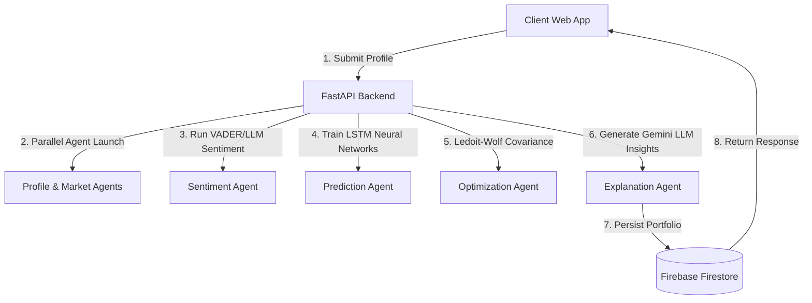

# 📈 FinAgent Pro

**FinAgent Pro** is a premium, multi-agent AI-powered personalized financial advisor prototype. It ingests live market data and financial news sentiment, builds user risk profiles, trains lightweight LSTM forecasting models, performs Ledoit‑Wolf covariance shrinkage for portfolio optimization, and generates human-friendly financial explanations.

---

## 🌟 Key Features

* **🤖 Multi-Agent Orchestration:** A collaborative pipeline of dedicated AI agents:
  * **Profile Agent:** Ingests and refines investor preferences, duration, and stated risk.
  * **Market Data Agent:** Fetches live historical ticker metrics using `yfinance`.
  * **Sentiment Agent:** Performs sentiment scanning utilizing VADER and optional LLM scoring.
  * **Prediction Agent:** Automates training & iteration of TensorFlow LSTM neural networks per ticker.
  * **Portfolio Optimization Agent:** Computes modern portfolio theory weightings with Ledoit-Wolf shrinkage.
  * **Explanation Agent:** Generates human-friendly financial reasoning powered by Google Gemini LLM.
* **📈 Real-Time Backtesting:** Tracks per-ticker validation MSE and annual portfolio volatility, Sharpe ratio, and Max Drawdown.
* **🔒 Database Integration:** Persists histories, user allocations, and models inside Firebase Firestore.
* **🎨 Premium Glassmorphism UI:** Interactive client dashboard with smooth animations and history exploration.

---

## 🛠️ Technology Stack

* **Backend:** FastAPI (Python), Uvicorn, Pydantic, TensorFlow 2.16+, Scikit-Learn, Pandas, NumPy, yfinance, Firebase Admin SDK
* **Frontend:** Vanilla HTML5, CSS3 (Glassmorphism design tokens), JavaScript (Fetch API & state machine)

---

## ⚙️ Architecture Workflow



---

## 🚀 Setup & Installation (Windows)

Follow these steps to boot the application on your local machine:

### 1. Clone & Set Up the Python Environment
Open a terminal in the root project folder:
```powershell
# Create virtual environment
python -m venv .venv

# Activate virtual environment
.\.venv\Scripts\Activate.ps1

# Upgrade pip
python -m pip install --upgrade pip

# Install dependencies
pip install -r requirements.txt
```

### 2. Configure Environment Variables
Create a `.env` file in the root directory and add the following keys:
```env
# Firebase Admin SDK Credentials file
FIREBASE_CREDENTIALS=serviceAccountKey.json

# Gemini API Key for Explanation & Sentiment
GEMINI_API_KEY=YOUR_GEMINI_API_KEY

# News API key (optional; fallback to mock sentiment if empty)
NEWSAPI_KEY=YOUR_NEWSAPI_KEY
```

---

## 🏃 Running the Application

To run the application, open **two separate terminal windows** and execute the commands below:

### 🌐 Terminal 1: Backend API (FastAPI)
```powershell
cd FinAgentPro
.\.venv\Scripts\Activate.ps1
uvicorn main:app --port 8000 --reload
```
*The FastAPI server will boot and serve on **`http://localhost:8000`**.*

### 🖥️ Terminal 2: Frontend Client (Static Server)
```powershell
cd FinAgentPro\frontend
python -m http.server 3000 --bind 127.0.0.1
```
*This starts a server on **`http://127.0.0.1:3000`** which avoids local browser security (CORS) blocks.*

---

## 📊 Verification & Usage
1. Open your browser and navigate to **[http://127.0.0.1:3000](http://127.0.0.1:3000)**.
2. Toggle to **Register** and create your account credentials.
3. Configure your Annual Income, Target Investment, Horizon, and Risk preference.
4. Click **Run Full Analysis** to execute the multi-agent optimization model.
5. Explore past generated portfolios on your **History** tab!
